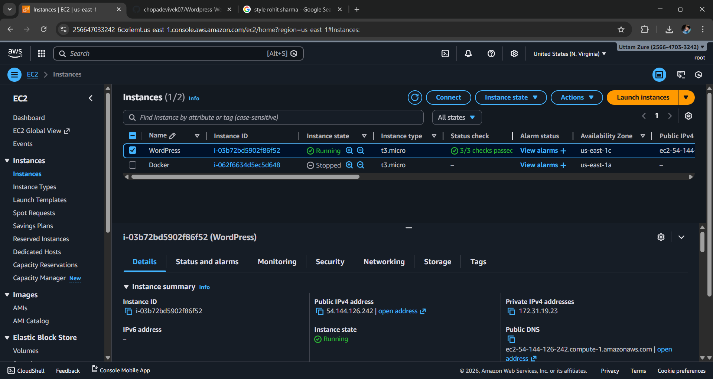

#  **WordPress Deployment on AWS EC2 Using LAMP**

## 📍**Introduction**

This project provides a comprehensive guide to deploying a WordPress website on a server using a web server
(Apache) and a database (MariaDB). It walks through environment setup, installation of required
dependencies, WordPress configuration, and final deployment steps to make the site publicly accessible.
Following this guide ensures a secure, scalable, and production-ready WordPress deployment.

### **Feature**

- Dynamic Website – WordPress provides a fully functional CMS for blogs, portfolios, or business
websites.
- Database-Driven – Uses MySQL/MariaDB to store content, user data, and settings.
- Theme and Plugin Support – Easily customize the site with themes and plugins.
- Scalable – Supports multiple users and high traffic when deployed on a proper server.

### **Prerequisites**

Before deploying the WordPress website, ensure the following are installed and configured:

- Linux Server – Amazon Linux
- Web Server – Apache installed and running.
- PHP – Along with required PHP extensions.
- Database – MariaDB for storing WordPress data.

## 🖼️ Architecture Diagram


## **Steps for Delpoyment**


## Step 1: Launch EC2 instance and Establishing a secure connection to your EC2 instance


---


- **Executing an SSH command in Git Bash to establish a secure remote connection from the local machine to the EC2 instance using the private key file and instance credentials.**


## Step 2: Automating LAMP Stack Setup on AWS EC2

**1. Create a LAMP.sh file**
    
    
     sudo vim LAMP.sh 
    

**2. Insert the code for installing apache, mysql and php**

 ```bash
     sudo yum update
     sudo yum install httpd mariadb-server php -y
     sudo system start httpd mariadb-server php-fpm
     sudo system enable httpd mariadb-server php-fpm
```

.png)

**3. Run the file**

```bash
sudo bash LAMP.sh
```
----

## Step 3: Download and Configure WordPress

 ```bash
# Download WordPress
sudo wget https://wordpress.org/latest.tar.gz
# Extract the archive
sudo tar -xvzf latest.tar.gz
```

.png)


 ## Step 4: Remove latest.tar.gz and  go to the wordpress folder
```bash
sudo rm -rf latest.tar.gz
ls
cd wordpress/
```
.png)


-----
## Step 5: Create WordPress Database

**1. Generate the username and password.**
```sql
sudo mysql
alter user root@localhost identified by 'root';
```
.png)

**2. Login to Mysql (mariadb105-server) and Create Database**

```sql 
sudo mysql -u root -p
--Create Database
create database wordpressdb;
--Show database
show databases;
```
.png)

### Step 6: Install conector

```bash
sudo yum install php8.4-mysqlnd.x86_64
```


### Step 7: Change ownership of the files

.png)

### Step 8: Hit the public ip in the browser

**1. Click on Continue**


**2. Click on Let,s go**

**3. Fill the information and click on Submit**
.png)
---
**4. Run the Installation**

**5. Fill the information and cilck on Install Wordpress**

---
**6. Login to Wordprees**


---
**7. Deployed Wordpress Successfully**


**8. Create Pages In Wordpress Means Create Posts**


P**9. ublish Our Post**


**10. Table automatically added to Database**


### 🔴 **Summary**

This project provides a complete guide to deploying a WordPress website on a Linux server using a web
server (Apache) and a database (MariaDB). It covers downloading and installing WordPress, configuring file
permissions, setting up the database, and configuring the web server for production use. Following this guide
ensures a secure, scalable, and fully functional WordPress site ready for public access.